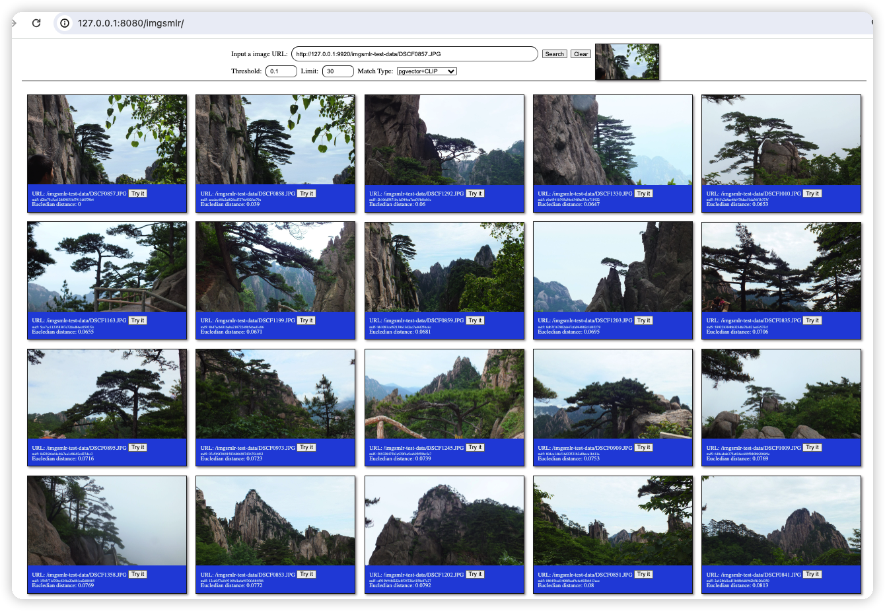
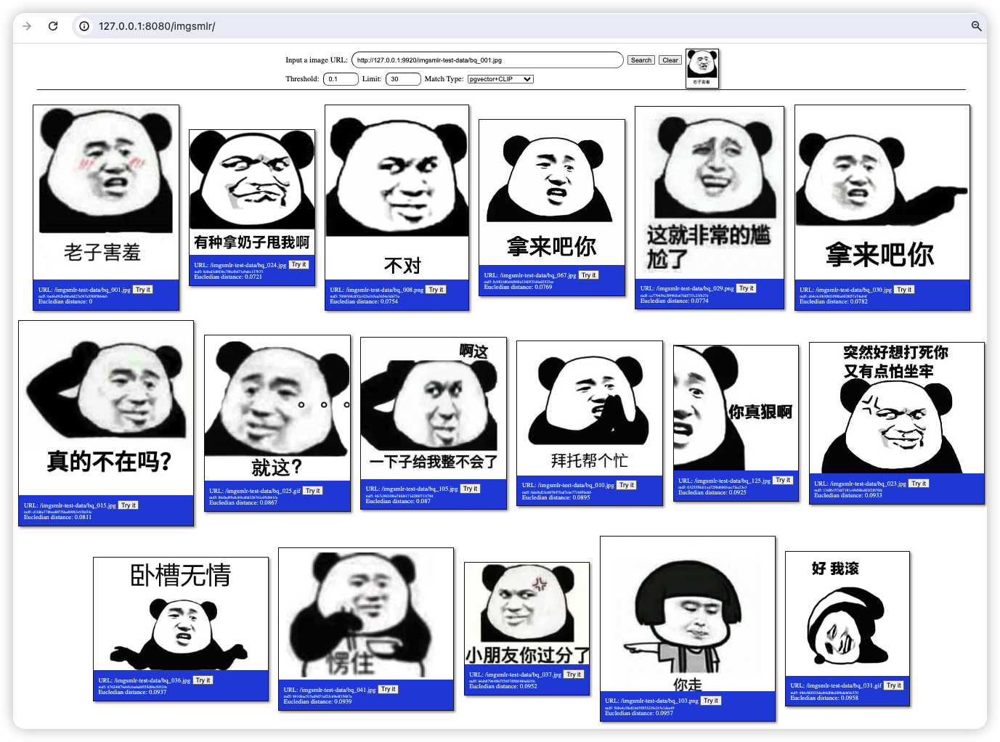

# imgsmlr-server


Image search service based on the `imgsmlr` or `pgvector` extension of `PostgreSQL`. It supports image search by image.

Image feature extraction supports the `imgsmlr` extension algorithm and the `CLIP` algorithm.

* Services provided include image and video similarity detection.
* It offers an illegal image filtering service.
* It enables searching for the original video based on video clips, video GIFs, and video screenshots.


# Reference

* [https://github.com/postgrespro/imgsmlr](https://github.com/postgrespro/imgsmlr)
* [https://github.com/jie123108/libimgsmlr](https://github.com/jie123108/libimgsmlr)
* [Contrastive Language-Image Pre-Training](https://github.com/openai/CLIP)

# Run

### Download source code

```
git clone https://github.com/jie123108/imgsmlr-server
cd imgsmlr-server
```

### Init database

###### Start by docker-compose

```shell
docker-compose up -d
```

If you want to install and start the database yourself, please follow the online tutorial to install the `imgsmlr` extension. And use `scripts/imgsmlr_init.sql` to initialize the database.

###### access the database

```
docker exec -ti imgsmlr-server_postgres_1 psql -U imgsmlr -d imgsmlr
```

### Start the server

```
pip install -r requirements.txt
python img-smlr-server.py
```

If the default configuration does not start properly. Please modify the configuration in `config.py` according to the actual situation.

# Test

### Add images

Adding images, currently only image URLs are supported. The more images the better. You can add them with the following command:

```curl
curl http://127.0.0.1:8140/imgsmlr/mgr/add -d '{"url": "http://host:port/image-file.jpg"}'
```

Tip: If you have already downloaded the image locally, you can start an `nginx` or `python` (`python3 -m http.server`) to turn the image into a URL.

### Search by image

###### Request

```curl
curl 'http://127.0.0.1:8140/imgsmlr/search' \
  -H 'Content-Type: application/json;charset=UTF-8' \
  -d '{"url":"http://host:port/search-image.jpg"}'
```

###### Response

```json
{
    "code": 200,
    "data": {
        "images": [
            {
                "dataId": null,
                "id": 212,
                "md5": "a230afeb27358888606f3105bfd05195",
                "meta": null,
                "remark": null,
                "simr": 0,
                "url": "http://host:port/image1.jpg"
            },
            {
                "dataId": null,
                "id": 205,
                "md5": "ce1321185d4b1318835775d04783c0c2",
                "meta": null,
                "remark": null,
                "simr": 1.06304,
                "url": "http://host:port/image2.jpg"
            },
            {
                "dataId": null,
                "id": 556,
                "md5": "f1e2c4f1cad7ef80fb16fe87623d4f82",
                "meta": null,
                "remark": null,
                "simr": 1.881019,
                "url": "http://host:port/image3.jpg"
            },
            ...
        ]
    },
    "msg": "OK"
}
````

### Fine-tuning Similarity Threshold Parameters

With regard to imgsmlr, a threshold setting in the span of 0 to 1 (or 0.9) tends to yield high precision. However, extending this range up to 2 can potentially boost the recall rate, albeit at the risk of generating a few false positives.
As for utilizing the CLIP+pgvector(Cosine distance) model, a similarity threshold within the range of 0 to 0.1 is typically accurate. Marginally raising the threshold to between 0.1 to 0.2 may in turn improve recall, although it may slightly enhance the incidence of misrecalls as well.
It is crucial to calibrate the actual threshold values according to your precise business requirements. This could be accomplished through iterative testing with your actual business data to strike the right balance between precision and recall.


### Test Page

You can test the image search function by visiting `http://127.0.0.1:8140/imgsmlr/`.

###### Screenshot of test page

The test image library is approximately 70,000 images in size. The images mainly come from NSFW, but some test images downloaded personally have also been added.


|  |
|:--:|
| *demo-p1* |

|  |
|:--:|
| *demo-p2* |

|  |
|:--:|
| *demo-p3* |

|  |
|:--:|
| *demo-p4* |

## LICENSE

[MIT](./LICENSE)
